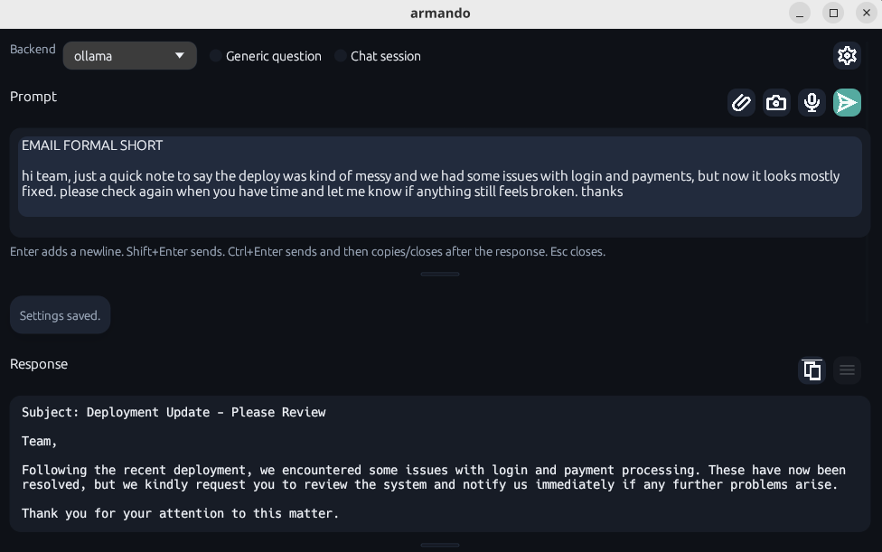
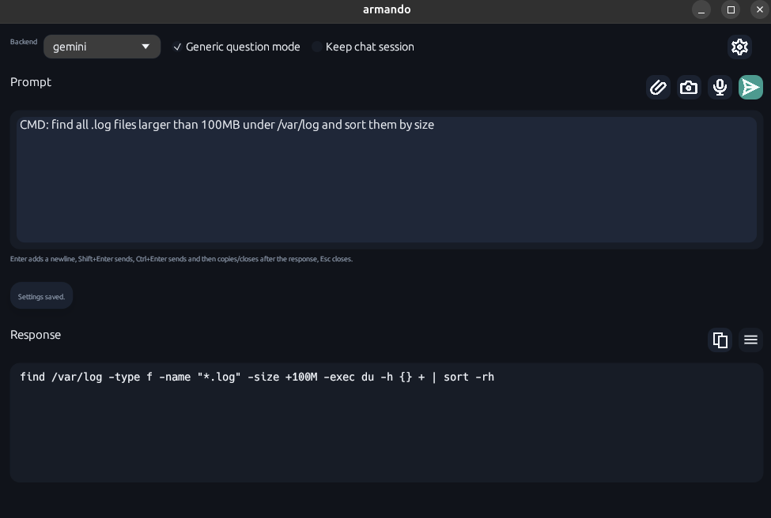
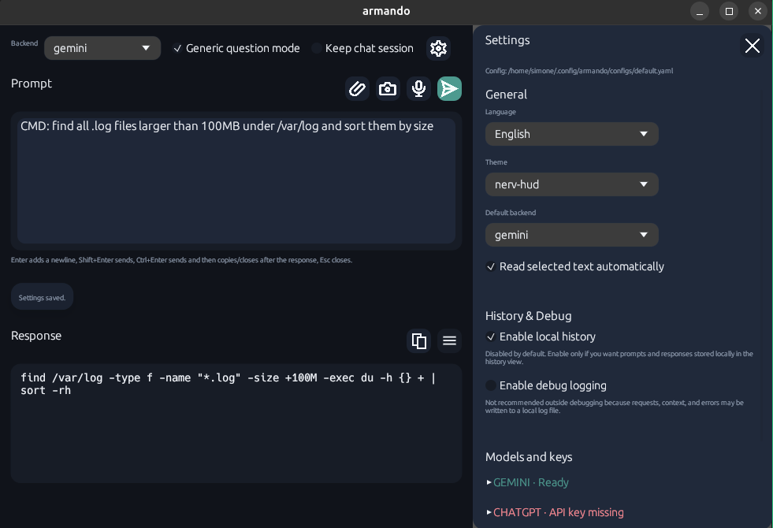

# armando

`armando` is a lightweight cross-platform desktop AI popup built in Rust with `egui`.
It stays close to your workflow so you can ask questions, rewrite text, attach images, and send prompts to Gemini, ChatGPT, Claude, or a local Ollama model.

## Highlights

- Native desktop app in Rust with a compact popup UI
- Multiple backends: `ollama`, `chatgpt`, `gemini`, `claude`
- Text-assist mode and generic-question mode
- External YAML configuration, themes, locales, and prompt preset files
- In-app GitHub release check with version comparison and download shortcut when an update is available
- Optional local history and optional debug logging
- Optional RAG with `keyword`, `vector`, or `hybrid` retrieval modes
- Image attachments, clipboard image paste, and voice dictation
- Release bundles for Linux, macOS, and Windows

## Development Approach

This repository is developed in a vibe-coding style, with fast iterative changes, but every change still goes through automated validation plus a double human check before any push: one review by the person or agent implementing the change, and a second human review at the parent/final check stage.

### Pre-commit Secret Guard

The repository ships a versioned git hook at `.githooks/pre-commit` that blocks accidental secret commits (for example real API keys or local `.env` files).
To enable it locally:

```bash
git config core.hooksPath .githooks
chmod +x .githooks/pre-commit
```

The local installer (`scripts/dev/install-local.sh`) applies this automatically.

### Pre-push Non-Regression Gate

The repository also ships a versioned git hook at `.githooks/pre-push` that runs non-regression checks before push.
Default profile:

- `cargo fmt --all -- --check`
- `cargo test --locked --all-targets`
- `scripts/ci/verify-ui-smoke-checklist.sh`

Tune the profile when needed:

```bash
ARMANDO_PRE_PUSH_PROFILE=quick git push   # fmt + tests
ARMANDO_PRE_PUSH_PROFILE=full git push    # fmt + tests + clippy
```

Emergency bypass (local only, use sparingly):

```bash
SKIP_PRE_PUSH_REGRESSION=1 git push
```

## Get armando

- Latest release: <https://github.com/Inoxiamo/armando/releases/latest>
- All releases: <https://github.com/Inoxiamo/armando/releases>

Start with [`/docs/getting-started/install.md`](/docs/getting-started/install.md) for the release download, OS-specific install steps, config paths, and first-run setup. The first-run card can also seed a new config from one of the bundled templates in `configs/`.

## Configure It

The repository ships defaults under [`configs/`](configs), [`configs/prompts/`](configs/prompts), [`themes/`](themes), and [`locales/`](locales).
`configs/` now doubles as a small set of reusable config templates for first-run setup, so the initial profile can start from a known-good base instead of an empty file. The bundled set currently includes `default`, `local`, `work`, `personal`, and `beta`.
After installation, `armando` reads configuration from the platform-standard config directory for `armando`, with this structure:

```text
armando/
  prompt-tags.yaml
  generic-prompts.yaml
  configs/
    default.yaml
    local.yaml
    work.yaml
    personal.yaml
    beta.yaml
  themes/
    my-theme.yaml
  locales/
    custom-language.yaml
```

In-source prompt preset templates now live under `configs/prompts/`. Runtime discovery still supports legacy root-level preset files for backward compatibility.

The ChatGPT backend uses OpenAI's Responses API.
For exact install paths and first configuration on each OS, see [`/docs/getting-started/install.md`](/docs/getting-started/install.md).

API keys can be loaded from environment variables (or a local `.env` file in the project/app working directory):

- `ARMANDO_OPENAI_API_KEY` (or `OPENAI_API_KEY`)
- `ARMANDO_GEMINI_API_KEY` (or `GEMINI_API_KEY`)
- `ARMANDO_ANTHROPIC_API_KEY` (or `ANTHROPIC_API_KEY`)

Keep `.env` local and uncommitted.

### Local Runtime Data

Operational data is split between config and app data directories:

- Config/profile files: platform config dir under `armando/` (see `/docs/getting-started/install.md`), unless overridden with `ARMANDO_CONFIG`.
- History (when enabled): `.../armando/history/history.jsonl`.
- Debug logs (when enabled): `.../armando/logs/debug.jsonl` and `.../armando/logs/debug-readable.log`.
- RAG vector DB: `rag.vector_db_path` from config. Default is `.armando-rag.sqlite3`.

Dev/local run context:

- When `rag.vector_db_path` is relative (default), it is resolved from the current working directory where you start the app/CLI (`cargo run`, `--rag-index`, etc.).
- Config discovery checks `ARMANDO_CONFIG`, executable-adjacent paths, current working directory, then the platform config dir.

The `ui` section supports visual preferences such as language and initial window height. Example:

```yaml
ui:
  language: "it"
  window_height: 640
```

Update channel can be pinned to stable-only or include RC builds:

```yaml
update:
  beta: false # true = include prerelease/RC updates
```

RAG is configured under `rag` and can be switched between lexical and semantic retrieval:

```yaml
rag:
  enabled: true
  engine: simple # simple | langchain
  mode: keyword # keyword | vector | hybrid
  documents_folder: "YOUR_RAG_DOCUMENTS_FOLDER"
  vector_db_path: ".armando-rag.sqlite3"
  max_retrieved_docs: 4
  chunk_size: 1200
  embedding_backend: "ollama" # optional, for vector/hybrid
  embedding_model: "nomic-embed-text" # optional, for vector/hybrid
  langchain_base_url: "http://127.0.0.1:8001" # used when engine=langchain
  langchain_timeout_ms: 8000
  langchain_retry_count: 1
```

`documents_folder` can also be supplied from `.env` with `ARMANDO_RAG_DOCUMENTS_FOLDER`.

When the settings panel is open, the footer shows the current app version and, only if a newer GitHub release exists, a small update button that opens the latest downloadable release.

## What The App Can Do

- Rewrite, clean up, summarize, translate, and reformat selected text in a popup without leaving the current workflow
- Switch between `Text assist` for rewriting existing text and `Generic question` for direct prompting
- Use `ollama`, `chatgpt`, `gemini`, or `claude` as the active backend
- Attach images from the file picker, paste screenshots from the clipboard, and use voice dictation
- Keep an in-memory chat session for follow-up turns without forcing persistent history on disk
- Save optional local history, then filter, copy, reuse, multi-select, and delete saved entries
- Change theme, language, backend, models, and credentials from the settings panel with live persistence
- Load provider model lists from backend APIs or a local Ollama instance and pick them from dropdowns
- See startup diagnostics, backend readiness, and recovery hints directly in settings
- Check for newer GitHub releases from the app and open the right update path for the current platform
- Start from bundled config profiles such as `default`, `local`, `work`, `personal`, and `beta`

## Planned

- MCP integration for safe external tools and richer runtime context
- Agent-oriented workflow improvements with clearer delegation, recap, and push-gating rules
- Beta tools panel for terminal, CLI, MCP, and backend-status visibility
- Safer command execution flow with explicit confirmation for sensitive actions

## RAG Modes

- `keyword`: lexical retrieval with SQLite FTS5/BM25; no embedding API calls.
- `vector`: embedding-based retrieval with cosine similarity.
- `hybrid`: combines lexical + vector scores.

## RAG Engine

- `simple` (default): built-in RAG indexing/retrieval in Rust (`keyword`/`vector`/`hybrid`).
- `langchain`: external local HTTP service handles documents, embeddings, and prepared prompt generation.

When `rag.engine: langchain` is enabled, armando calls:

- `POST /v1/rag/prepare` for request-time prepared prompts
- `POST /v1/rag/index` for `--rag-index` and UI indexing

If LangChain fails, armando retries once (configurable) and then falls back automatically to `simple`.

When vector scoring is active, `rag.embedding_backend` and `rag.embedding_model` let you decouple embedding from the currently selected query backend/model.
If `rag.embedding_backend` is not set, embeddings follow the selected query backend (or `default_backend` if needed).

### Ollama Recommendation For RAG

For local RAG, use a dedicated embedding model instead of reusing the chat model.

- Suggested RAG embedding backend/model:
  - `rag.embedding_backend: ollama`
  - `rag.embedding_model: nomic-embed-text`
- Suggested Ollama chat model can stay separate in `ollama.model` (for example `gemma3:1b`, `llama3`, etc.).

Download the dedicated embedding model once:

```bash
ollama pull nomic-embed-text
```

### Gemini: Query vs Embedding Model Mismatch

Gemini can query with one model and embed with another. A common failure is using a text-generation model as `rag.embedding_model`.

- Symptom: normal Gemini chat works, but RAG indexing/retrieval fails on embedding calls.
- Cause: query uses `generateContent`, embeddings require a model that supports `embedContent`.
- Fix: set `rag.embedding_model` to an embedding model (for example `text-embedding-004`), or remove the override and let fallback pick a compatible embedding model.
- If needed, pin `rag.embedding_backend: gemini` so embeddings do not follow a different active backend.

To pre-index documents offline:

```bash
cargo run -- --rag-index
```

## CLI Mode

`armando` can run directly in terminal without opening the UI.

Examples:

```bash
armando --ask "GENERIC: explain what docker compose does"
armando --ask "CMD: list files sorted by size in current folder"
printf "WORK: rewrite this update for a customer" | armando --stdin --text-assist
armando --ask "CMD: show top 5 memory processes on Linux" --json
armando --ask "GENERIC: explain rust ownership" --request
```

CLI defaults to `Generic question` mode for lower token usage. You can force mode with `--generic` or `--text-assist`, override backend with `--backend <name>`, emit machine-readable output with `--json`, and print the exact prepared request sent to the model with `--request`.

## Prompt Presets

Text-assist tags such as `WORK`, `EMAIL`, `FORMAL`, `SHORT`, and `CMD` are loaded from `configs/prompts/prompt-tags.yaml` (fallback: `prompt-tags.yaml`).
Generic-question presets such as `GENERIC:` and `CMD:` are loaded from `configs/prompts/generic-prompts.yaml` (fallback: `generic-prompts.yaml`).
Language selection is handled centrally by the app, with support for explicit tags such as `EN`, `ENG`, `ITALIAN`, `ESP`, `FRA`, `DEU`, `JPN`, and many other common aliases.

Both files are read only at startup. The merge order is:

- built-in defaults
- legacy `aliases` from `configs/default.yaml`
- dedicated prompt files, which win on conflicts

Example `configs/prompts/prompt-tags.yaml`:

```yaml
tags:
  WORK: "Keep the output professional and work-oriented."
  EMAIL: "Write or rewrite the text as a professional, clear, and natural email."
  SHORT: "Keep the final result short and concise."
```

Example `configs/prompts/generic-prompts.yaml`:

```yaml
tags:
  GENERIC:
    instruction: ""
    strip_header: true
  CMD:
    instruction: "If the requested answer is a shell command or terminal one-liner, return only the final command, with no Markdown, no backticks, and no extra text."
    strip_header: true
```

If no explicit language tag is provided, `armando` keeps the source language in text-assist mode and answers in the user request language in generic-question mode. Language changes are applied only when explicitly requested (for example translation requests).

The old `aliases` section in the main config is still supported as a legacy fallback, but new presets should go into the dedicated files.

### Customize Preprompts

The fastest way to adapt `armando` to your workflow is to customize the prompt preset files.

Use `configs/prompts/prompt-tags.yaml` for rewrite-oriented tags that modify how an existing text should be transformed:

```yaml
tags:
  FORMAL: "Rewrite the result in a formal and polished tone."
  BUGFIX: "Focus on actionable technical corrections and keep the output precise."
  SHORT: "Keep the final result short and concise."
```

Use `configs/prompts/generic-prompts.yaml` for direct-question presets that should inject a reusable instruction block:

```yaml
tags:
  ARCH:
    instruction: "Answer like a pragmatic software architect. Prefer tradeoffs, constraints, and implementation steps."
    strip_header: false
```

This lets you build your own preprompt library for recurring work such as email cleanup, technical rewriting, architecture questions, translation, documentation polish, or shell-command generation.

### Automatic Formatting And Cleanup

In `Text assist` mode, `armando` is designed for quick text transformation rather than raw chat. A typical flow is:

1. paste or auto-capture the source text
2. add one or more tags such as `EMAIL`, `FORMAL`, `SHORT`, or a custom preset
3. send the request and copy the cleaned result back where you need it

This is the best place to show automatic formatting examples in the documentation, because the app can turn rough notes into a cleaner email, normalize bullet points, tighten wording, or adapt tone and language in one step.



### How To Use `CMD`

`CMD` is available in the generic prompt presets and is meant for command-style answers.

Use it in `Generic question` mode when you want only the final shell command or one-liner, without Markdown or explanation. Example prompt:

```text
CMD: find all .log files larger than 100MB under /var/log and sort them by size
```

Expected behavior: the assistant returns just the command, ready to copy into a terminal.

Without `CMD`, the same request can return a normal explanatory answer in Markdown. With `CMD`, the preset pushes the backend toward a direct command-only output.



## Settings And Diagnostics

The settings panel centralizes the most important runtime controls and checks:

- active backend selection
- model selection and provider-specific settings
- language and theme preferences
- startup diagnostics and recovery hints
- update status and runtime configuration feedback



## Keyboard Shortcuts

System-level shortcuts are supported on Linux, macOS, and Windows.
The release bundle does not yet provide one built-in universal global hotkey that registers itself identically on every OS, so shortcut setup is still delegated to the operating system.

Use [`/docs/guides/shortcuts.md`](/docs/guides/shortcuts.md) for the practical setup steps.

## Public Docs

- Install and first setup: [`/docs/getting-started/install.md`](/docs/getting-started/install.md)
- Keyboard shortcuts: [`/docs/guides/shortcuts.md`](/docs/guides/shortcuts.md)
- Releases, versions, and artifacts: [`/docs/guides/releases.md`](/docs/guides/releases.md)
- Visual regression checklist: [`/docs/qa/visual-regression.md`](/docs/qa/visual-regression.md)
- Repository map: [`/docs/reference/repository-structure.md`](/docs/reference/repository-structure.md)

## Local Validation

The repository includes containerized validation in [`.github/workflows/ci.yml`](.github/workflows/ci.yml) and tagged release automation in [`.github/workflows/release.yml`](.github/workflows/release.yml).

To run the same Linux container flow locally:

```bash
docker build -f docker/test-runner.Dockerfile -t armando-test-runner .
docker run --rm -v "$(pwd):/workspace" -w /workspace armando-test-runner bash scripts/ci/run-container-tests.sh
```

This produces logs under `target/test-artifacts/` and a Linux bundle under `target/dist/`.
